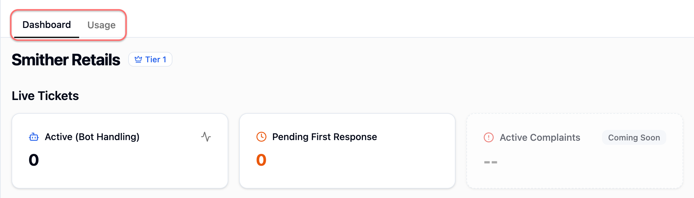
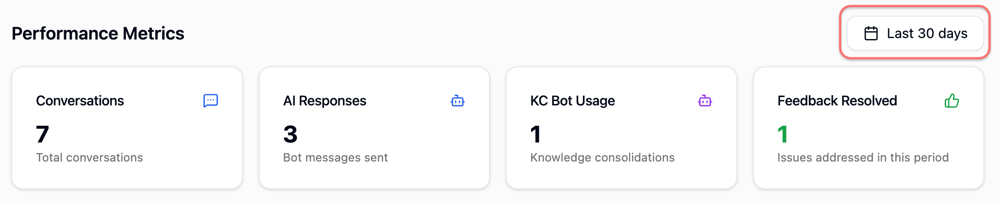

# Dashboard

### Dashboard Layout

The Dashboard provides a high-level view of:

* [Live Tickets](dashboard.md#live-tickets)
* [Feedback & Responses](dashboard.md#feedback-and-response)
* [Performance Metrics](dashboard.md#performance-metrics)


Navigation tab — Located in the top-left corner of the page to switch between [Dashboard](dashboard.md) and [Usage](usage.md).



***

### Live Tickets

Use Live Tickets to review what needs attention right now.

#### **Active (Bot Handling)**

This tab shows tickets currently handled by the bot.

1. Select **Active (Bot Handling)** to open [Chat](https://app.gitbook.com/s/BW7n4ClAhZvbgvusylCd/chat).
2. Review the conversations in the **Bot category**.

#### **Pending First Response**

This tab shows tickets waiting for the first human response.

1. Select **Pending First Response** to open [Chat](https://app.gitbook.com/s/BW7n4ClAhZvbgvusylCd/chat).
2. Review the conversations in the **Human** **category**.

#### **Active Complaints**

This feature requires additional setup before it can be enabled and shown on the Dashboard. To learn what is required, select Contact Effex and contact [hello@chatlyst.io](mailto:hello@chatlyst.io) for details.

***

### Feedback & Response

Use Feedback & Response to track feedback status and knowledge document health.

#### **Feedback Status**

This tab summarises feedback status.

1. Select **Feedback Status** to open [Train & Test bot](https://app.gitbook.com/s/BW7n4ClAhZvbgvusylCd/train-and-test-bot).
2. Review submitted feedback and complete training as needed.

#### **Knowledge Documents**

This tab shows the number of uploaded knowledge documents and whether each is Clean or Pending.

1. Select **Knowledge Documents** to open [Business Knowledge](https://app.gitbook.com/s/BW7n4ClAhZvbgvusylCd/business-knowledge).
2. Review templates and manage feedback.

#### **Top Issues**

This feature requires additional setup before it can be enabled and shown on the Dashboard. To learn what is required, select Contact Effex and contact [hello@chatlyst.io](mailto:hello@chatlyst.io) for details.

***

### Performance Metrics

Use Performance Metrics to review activity and trends.


Date Range — Select a date range in the top-right corner to control the time period shown in charts and totals.



#### **Conversations**

This tab shows the total number of conversations in the selected date range.

#### **AI Responses**

This tab shows the number of bot messages in the selected date range.

#### **KC Bot Usage**

This tab shows how many times Knowledge Consolidation was used in the selected date range.

#### **Feedback Resolved**

This tab shows how many feedback items were handled in the selected date range. This tab links to [Train & Test bot](https://app.gitbook.com/s/BW7n4ClAhZvbgvusylCd/train-and-test-bot).

#### **Resolved Conversations**

This tab shows how many conversations were closed in the selected date range.

#### **Bot vs Human**

This tab shows the ratio of conversations handled by the bot versus a human.

#### **CSAT**&#x20;

This feature is planned for a future release.

#### **Performance Chart**

#### **Activity Over Time**

This chart shows resolved conversations and bot messages over time.


Hover over the chart to review the numbers.



#### **Tickets by Channel**

This chart shows ticket distribution by channel.


Hover over segments to review the numbers.



#### **Sentiment Analysis**

This feature requires additional setup before it can be enabled and shown on the Dashboard. To learn what is required, select Contact Effex and contact [hello@chatlyst.io](mailto:hello@chatlyst.io) for details.

