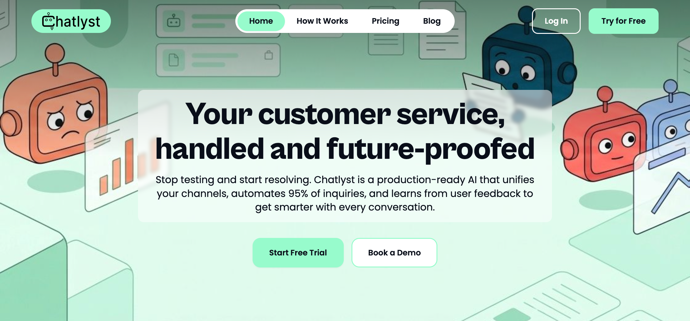

# Log In

### How to log in Chatlyst



#### Open the log in page

Go to [https://chatlyst.io/](https://chatlyst.io/).

<figure><figcaption></figcaption></figure>




In the top-right corner, select **Log in**.

<figure><figcaption></figcaption></figure>




On the Log in page, choose a login method.

#### Option A: Log in with email

1. Enter the email address and password.
2. Select **Log in**.

<figure><figcaption></figcaption></figure>

#### Option B: Log in with Google

1. Select **Continue with Google**.
2. Sign in to the Google account.
3. Follow the on-screen prompts to complete log in.

<figure><figcaption></figcaption></figure>

#### Option C: Log in with Facebook

(Coming Soon)



#### Confirm access to Home

After successful log in, Chatlyst opens the Home page.

<figure><figcaption></figcaption></figure>




***

### Remember Me

Save login details so the credentials do not need to be entered each time.

### Forgot Password



Use this option to reset the account password if the password is not available.




Enter the registered email address, then select **Send Reset Link**.




Open the email and select **Reset Password**.


**Important Note**: The reset link is valid for 30 minutes.





Create a new password that meets the following requirements:

* At least 8 characters
* At least 1 uppercase letter
* At least 1 lowercase letter
* At least 1 number

Select **Reset Password** to finish.



