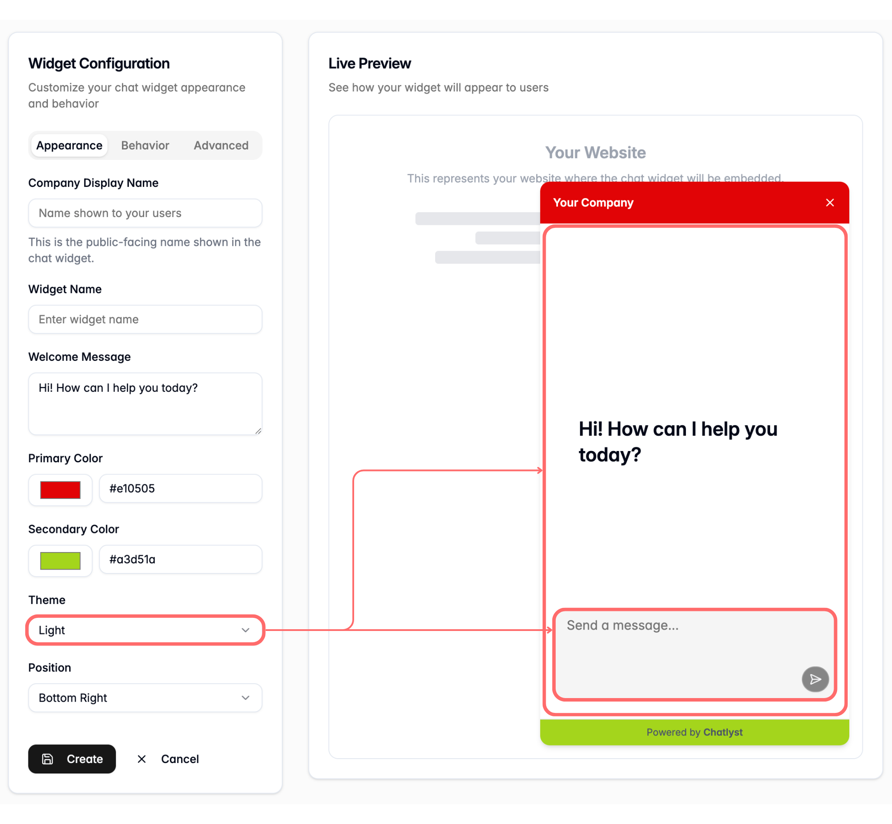
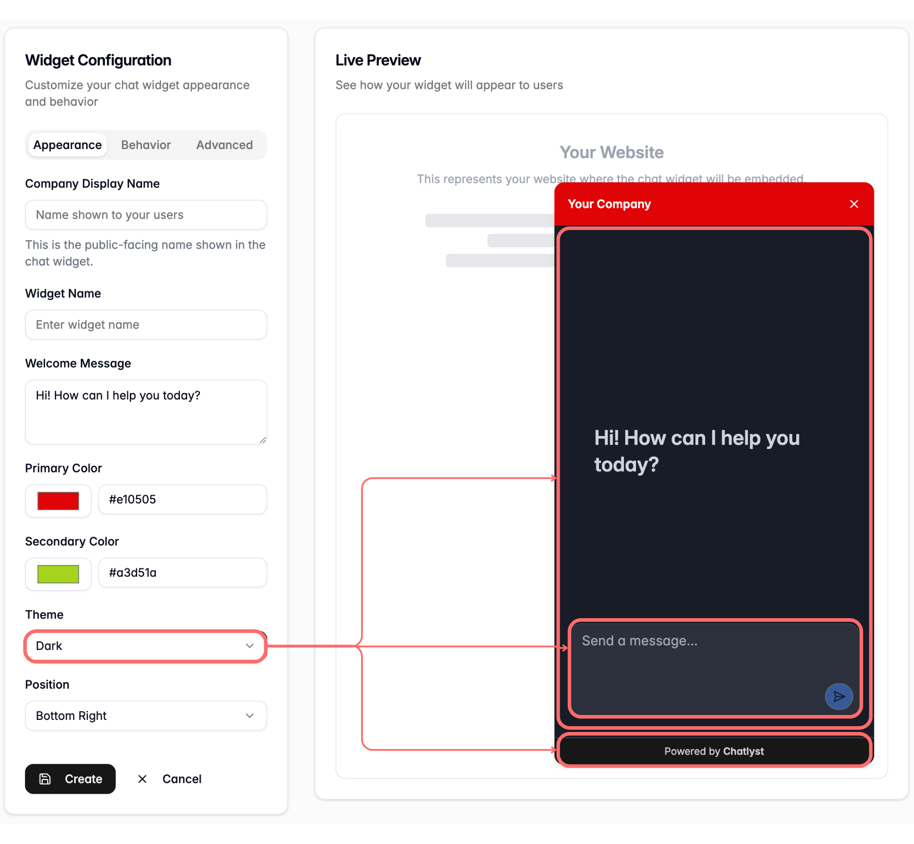

# Add a Widget

In the Website Embed channel, select **Add Widget**.

On the widget setup page, enter the widget details and configure settings using the left panel. Review the live preview on the right as changes are made, then complete the setup.&#x20;

Widget configuration includes three sections: [Appearance](add-a-widget.md#appearance), [Behavior](add-a-widget.md#behavior), and [Advanced](add-a-widget.md#advanced).


Navigation tab — use this tab to move between [Appearance](add-a-widget.md#appearance), [Behavior](add-a-widget.md#behavior), and [Advanced](add-a-widget.md#advanced), and quickly review or update specific sections.

.png>)




### Appearance

**Control the visual design of the widget, including name, colors, and placement on the page.**

Users can update the following fields:

1. **Basic Information**
   * **Company Display Name** — the public-facing name shown in the widget header.
   * **Widget Name** — an internal name used to manage multiple widgets.
   * **Welcome Messag**e — the greeting shown when the widget opens.

2. **Widget Color**

* **Primary Color** — sets the primary color used across the widget and defines the overall brand look. This color applies to the header and the widget launcher and does not change when switching themes. A color can be selected in the color picker or entered as a HEX code.

.png>) .png>)

* **Secondary Color** — sets the secondary color used for supporting UI elements and creates contrast with the primary color. This color applies only to the footer.

2.  **Widget Theme**

    * To set the widget theme for the widget experience, choose the theme option that best matches the intended look and feel for visitors.
      * **Light** — applies light styling to the widget body and input field.
      * **Dark** — applies dark styling to the widget body, input field, and footer.
      * **Auto** — automatically sets the widget theme based on system settings.

    
<figure><figcaption>
Light Theme
</figcaption></figure> <figure><figcaption>
Dark Theme
</figcaption></figure>

3. **Position**
   * To set where the widget appears on the website, choose the position where it will be displayed for visitors (**Bottom Right**, **Bottom Left**, **Center**, or **Embedded**). This setting determines where the widget  shows up on the screen, or whether it appears inline where the widget is embedded on the page.

.png>) .png>)




### Behavior

**Control how the widget interacts with visitors**

* **Human Handoff** — controls what happens when the bot needs to hand the conversation back to a live agent. If this setting is turned off, the conversation automatically closes when the bot attempts to route the chat to a human agent, instead of keeping the session open for a takeover. The default setting is turned on.

<figure><figcaption></figcaption></figure>




### Advanced

**Adjust technical and session settings**

* **Max Assistant Messages Per Session** — sets the maximum number of assistant messages allowed in a single chat session. When the limit is reached, the chat switches to a human user, and the status updates to **Pending 1st Response**.


The default is 30 messages per session, with a minimum of 10.


* [**Session Timeout**](add-a-widget.md#session-times-out) **(minutes)** — sets how long a session stays active after the most recent message. The session stays active as long as messages continue. If no new message arrives within the set time (measured from the last message), the session expires and closes. If a human takes over during the session, the session remains active.


The default value is 1,440 minutes (24 hours). This is the recommended settings.&#x20;


<figure><figcaption></figcaption></figure>

Session Timeout

* When the session times out, the widget prompts visitors to start a new conversation so chatting can continue after the previous session expires.
* A timed-out session closes automatically in Chat and no longer appears as an active conversation.




### Complete Configuration

After finishing configuration, select **Create**.

<figure><figcaption></figcaption></figure>




### Widget Activation

After a widget is created, the next page opens automatically so the widget details and activation steps can be reviewed.

<figure><figcaption></figcaption></figure>

1. In the Widget Configuration tab (in the middle of the page), confirm the widget status shows **Draft** (inactive).
2. In the **Embed Code** tab (at the bottom of the page), review the inactive reminder message.
3. To activate the widget, toggle it on in the top-right corner.

<figure><figcaption></figcaption></figure>

4. Confirm the widget status changes from **Draft** to **Active** and the inactive reminder message no longer appears.

<figure><figcaption></figcaption></figure>



