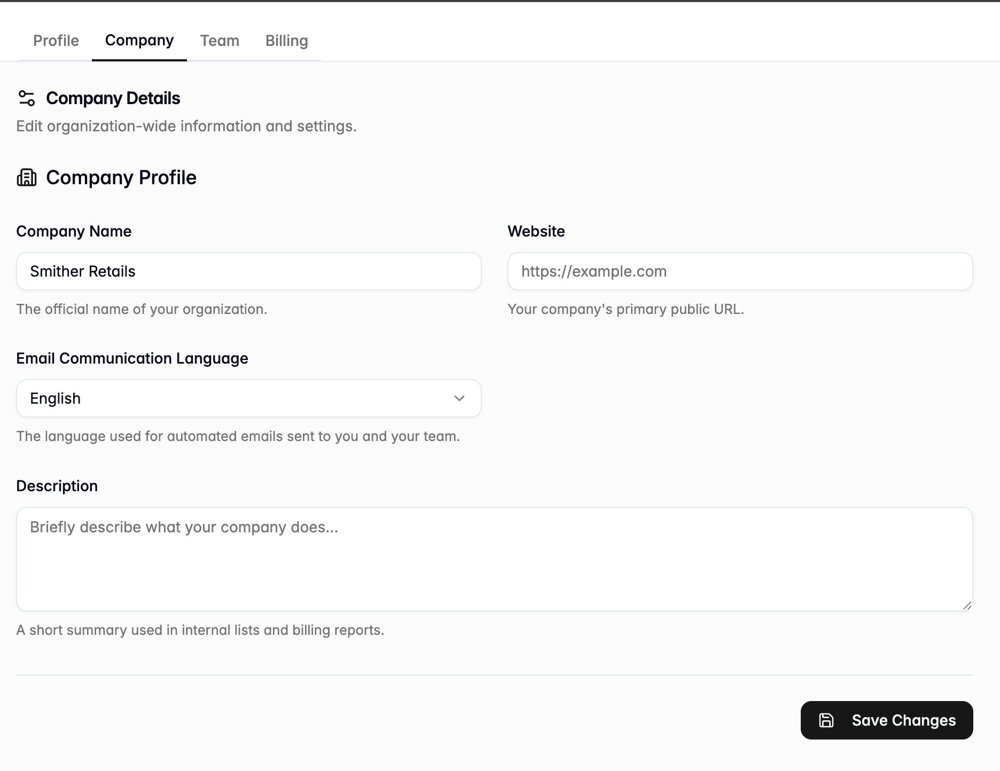

# Company

Use Company to update your company profile details:

* Company name
* Website
* Email Communication Language
* Description

You can update this information at any time in **Settings**. You may also enter it during the [Create Account flow](../getting-started/create-account.md) when setting up a new workspace for the first time.

<figure><figcaption></figcaption></figure>

1. Finish updating the details.
2. Review your changes to confirm everything is correct.
3. Select **Save Changes** to apply the updates.

<figure><figcaption></figcaption></figure>

